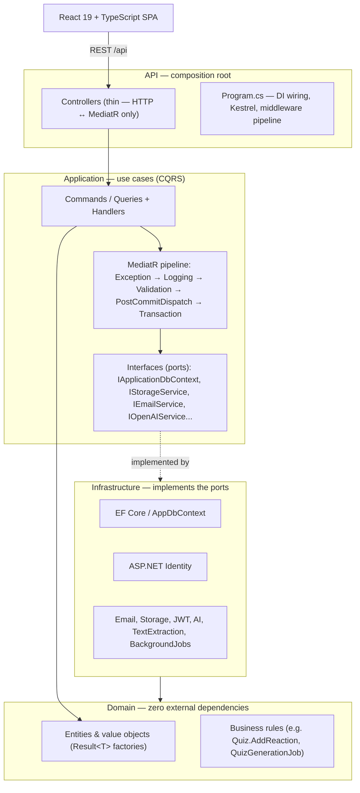

# KNOX

**A university knowledge hub for IT students** — courses, hierarchical course materials, hand-authored and AI-generated quizzes, all built on a strictly-layered .NET backend and a modern React frontend.


---

## Overview

KNOX (internally, `JadaraITKnowledgeSystem`) is an LMS-style platform organized around a **University → Faculty → Major** hierarchy. Students enroll in courses, browse course materials arranged in folders, and take quizzes that are either written by hand by users with the **Writer** role or generated automatically by AI from an uploaded PDF/DOCX/PPTX file.

The backend is a .NET 10 solution built strictly to Clean Architecture, and the frontend is a React 19 + TypeScript SPA. Both are designed to run together via Docker Compose with a single command.

## Features

- **Auth**: JWT access/refresh tokens, role hierarchy (`SuperAdmin > Admin > Writer > User`), OTP-based email verification, forgot/reset password, change password
- **Courses**: course catalog scoped by major, hierarchical folders and materials, course resources, enrollment
- **Quizzes**: hand-authored quizzes (single choice, multiple choice, true/false, short answer), scoring and review, like/dislike reactions
- **AI quiz generation**: upload a PDF/DOCX/PPTX course material, extract its real text (iText7 / DocumentFormat.OpenXml), chunk it, and generate quizzes from the content via OpenAI — processed through a post-commit background job queue rather than blocking the request
- **Profile**: editable profile, profile picture upload/crop, academic info (university/faculty/major)
- **i18n**: English and Arabic

## Tech Stack

**Backend** — .NET 10, Clean Architecture (Domain / Application / Infrastructure / API), EF Core 10 + SQL Server, ASP.NET Identity + JWT, MediatR (CQRS), FluentValidation, AutoMapper, Swagger.

**Frontend** (`../KNOX_Frontend/uni-hub`, sibling directory) — React 19, TypeScript, Vite 7, React Router 7, TanStack Query, Axios, Tailwind v4 + shadcn/ui, react-i18next.

**Infrastructure** — Docker Compose, SQL Server, local disk storage served via ASP.NET static files, Brevo (primary) / AhaSend (fallback) for transactional email, OpenAI for AI quiz generation.

## Architecture

The backend follows Clean Architecture with a strict dependency direction — inner layers never depend on outer ones:



```
KNOX_Backend/
├── JadaraITKnowledgeSystem.Domain/          # Entities, value objects, domain logic. Zero external dependencies.
├── JadaraITKnowledgeSystem.Application/     # Use cases (CQRS): Commands/Queries, interfaces, MediatR pipeline
├── JadaraITKnowledgeSystem.Infrastructure/  # EF Core, Identity, email/storage/AI services, background jobs
└── JadaraITKnowledgeSystem.API/             # Composition root: controllers, middleware, Program.cs

KNOX_Frontend/uni-hub/                        # React 19 + TypeScript SPA (sibling repo)
├── src/features/                             # auth, courses, quizzes, profile, dashboard, ...
├── src/shared/                                # shadcn/ui components, shared UI primitives
└── src/lib/                                   # API client, routing, i18n
```

Key patterns: every use case is a MediatR `Command`/`Query` + `Handler`; domain and application operations return a `Result<T>` instead of throwing for expected failures; `TransactionBehavior` wraps every `*Command` in an EF Core transaction automatically; a `DispatchPostCommitJobsBehavior` sits just outside the transaction so background work (like AI quiz generation) is only ever queued **after** the commit has genuinely succeeded — no polling, no arbitrary delays.

## Getting Started

### Prerequisites

- [Docker](https://www.docker.com/) and Docker Compose
- A running SQL Server instance reachable from the containers (see note below)

### Quick Start (Docker)

```bash
# From the parent folder that contains both KNOX_Backend/ and KNOX_Frontend/
cp .env.example .env    # fill in real secrets (JWT secret, SQL connection string, OpenAI/Brevo keys)
docker compose up --build -d
```

- Frontend: **http://localhost:5173**
- Backend API + Swagger: **http://localhost:5001**

The backend container connects to SQL Server via `host.docker.internal` — this repo's `docker-compose.yml` does not define its own database service, so point `DB_CONNECTION_STRING` in `.env` at whichever SQL Server instance you're running (a local container, LocalDB, etc.).

On first boot, `RoleSeeder` and `DataSeeder` run automatically and idempotently to create the roles, a starter university/faculty/major hierarchy, and a SuperAdmin account.

### Running Locally (no Docker)

```bash
# Backend
cd JadaraITKnowledgeSystem.API
dotnet user-secrets list   # verify JWT/OpenAI/Brevo/SQL secrets are set
dotnet run                 # http://localhost:5001

# Frontend (separate terminal)
cd ../KNOX_Frontend/uni-hub
npm install
npm run dev                # http://localhost:5173
```

Secrets are managed via `dotnet user-secrets` locally — `appsettings.json` only holds placeholders (see `appsettings.json.example`).

## Seeded Accounts

| Role | Email | Password |
|---|---|---|
| SuperAdmin | `admin@knox.com` | `Admin@123456` |

Seeded academic hierarchy: **Jadara University** → **Faculty of Information Technology** → **Computer Science** / **Information Technology**.

## Known Limitations

- **AI quiz generation requires a funded OpenAI API key.** Text extraction, chunking, and the background job pipeline all work independently of OpenAI and are fully verified; only the final "generate questions from text" call needs a working key with available quota.
- **No automated test suite** (backend or frontend) and no CI pipeline yet.
- **AutoMapper 12.0.1** has a known high-severity advisory (`GHSA-rvv3-g6hj-g44x`); a version upgrade is pending.
- Password reset is **OTP-based** (a 6-digit code emailed to the user), not a clickable magic link.

## License

No license has been specified for this project yet.
