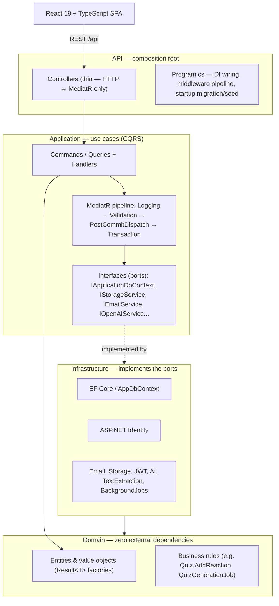

# KNOX

**A university knowledge hub for IT students** — courses, hierarchical course materials, hand-authored and AI-generated quizzes, all built on a strictly-layered .NET backend and a modern React frontend.


---

## Overview

KNOX (internally, `JadaraITKnowledgeSystem`) is an LMS-style platform organized around a **University → Faculty → Major** hierarchy. Students enroll in courses, browse course materials arranged in folders, and take quizzes that are either written by hand by users with the **Writer** role or generated automatically by AI from an uploaded PDF/DOCX/PPTX file.

The backend is a .NET 10 solution built strictly to Clean Architecture, and the frontend is a React 19 + TypeScript SPA. Both are designed to run together via Docker Compose with a single command.

## Features

- **Auth**: JWT access/refresh tokens, role hierarchy (`SuperAdmin > Admin > Writer > User`), OTP-based email verification, forgot/reset password, change password
- **Courses**: course catalog scoped by major, hierarchical folders and materials, course resources, enrollment
- **Quizzes**: hand-authored quizzes (single choice, multiple choice, true/false, short answer), scoring and review, like/dislike reactions
- **Course videos and files**: browsers upload straight to object storage (up to 2 GB by default) and play or download through short-lived signed CDN URLs
- **AI quiz generation**: upload a PDF/DOCX/PPTX course material, extract its real text (iText7 / DocumentFormat.OpenXml), chunk it, and generate quizzes from the content via OpenAI — processed through a post-commit background job queue rather than blocking the request
- **Profile**: editable profile, profile picture upload/crop, academic info (university/faculty/major)
- **i18n**: English and Arabic

## Tech Stack

**Backend** — .NET 10, Clean Architecture (Domain / Application / Infrastructure / API), EF Core 10 + SQL Server, ASP.NET Identity + JWT, MediatR 12 (CQRS), FluentValidation, OpenAPI + Swagger UI, RFC 7807 problem details, health checks; xUnit test suites (integration tests on real SQL Server via Testcontainers).

**Frontend** (`../KNOX_Frontend/uni-hub`, sibling directory) — React 19, TypeScript, Vite 7, React Router 7, TanStack Query, Axios, Tailwind v4 + shadcn/ui, react-i18next.

**Infrastructure** — Docker Compose with Caddy (HTTPS), nginx, the API and SQL Server 2022; S3-compatible object storage (Cloudflare R2, AWS S3 or self-hosted SeaweedFS) with Bunny CDN token-authenticated delivery for videos and files; Brevo (primary) / AhaSend (fallback) for transactional email; OpenAI for AI quiz generation. GitHub Actions build, test, scan and publish multi-arch images to GHCR.

## Architecture

The backend follows Clean Architecture with a strict dependency direction — inner layers never depend on outer ones:


```mermaid
flowchart TD
    subgraph API["API — composition root"]
        Controllers["Controllers (thin — HTTP ↔ MediatR only)"]
        Program["Program.cs — DI wiring, middleware pipeline, startup migration/seed"]
    end

    subgraph Application["Application — use cases (CQRS)"]
        Commands["Commands / Queries + Handlers"]
        Behaviours["MediatR pipeline: Logging → Validation → PostCommitDispatch → Transaction"]
        Ports["Interfaces (ports): IApplicationDbContext, IStorageService, IEmailService, IOpenAIService..."]
    end

    subgraph Infrastructure["Infrastructure — implements the ports"]
        EFCore["EF Core / AppDbContext"]
        Identity["ASP.NET Identity"]
        Services["Email, Storage, JWT, AI, TextExtraction, BackgroundJobs"]
    end

    subgraph Domain["Domain — zero external dependencies"]
        Entities["Entities & value objects (Result&lt;T&gt; factories)"]
        DomainLogic["Business rules (e.g. Quiz.AddReaction, QuizGenerationJob)"]
    end

    Controllers --> Commands
    Commands --> Behaviours
    Behaviours --> Ports
    Ports -.implemented by.-> Infrastructure
    Commands --> Entities
    Infrastructure --> Domain

    Frontend["React 19 + TypeScript SPA"] -->|REST /api| Controllers
```

```
KNOX_Backend/
├── JadaraITKnowledgeSystem.Domain/          # Entities, value objects, domain logic. Zero external dependencies.
├── JadaraITKnowledgeSystem.Application/     # Use cases (CQRS): Commands/Queries, interfaces, MediatR pipeline
├── JadaraITKnowledgeSystem.Infrastructure/  # EF Core, Identity, email/storage/AI services, background jobs
└── JadaraITKnowledgeSystem.API/             # Composition root: controllers, request contracts, error handling, Program.cs
tests/
├── JadaraITKnowledgeSystem.UnitTests/        # Domain, validators, pipeline behaviours, infrastructure services (no database)
└── JadaraITKnowledgeSystem.IntegrationTests/ # Handlers, migrations and the HTTP API against real SQL Server (Testcontainers)

KNOX_Frontend/uni-hub/                        # React 19 + TypeScript SPA (sibling repo)
├── src/features/                             # auth, courses, quizzes, profile, dashboard, ...
├── src/shared/                                # shadcn/ui components, shared UI primitives
└── src/lib/                                   # API client, routing, i18n
```

Key patterns: every use case is a MediatR `Command`/`Query` + `Handler`; domain and application operations return a `Result<T>` instead of throwing for expected failures; `TransactionBehavior` wraps every `*Command` in an EF Core transaction automatically; a `DispatchPostCommitJobsBehavior` sits just outside the transaction so background work (like AI quiz generation) is only ever queued **after** the commit has genuinely succeeded — no polling, no arbitrary delays.

## Getting Started

### Prerequisites

- [Docker](https://www.docker.com/) with Docker Compose v2.24+. SQL Server and object storage always run in containers.
- For working on the code outside containers: .NET SDK 10 and Node.js 22.
- The frontend checked out next to this repository. The expected layout is below; any other location works if you set `FRONTEND_DIR` in `deploy/.env.local`.

  ```
  <workspace>/
  ├── KNOX_Backend/            # this repository (git clone https://github.com/Aws03/KNOX.git KNOX_Backend)
  └── KNOX_Frontend/uni-hub/   # the frontend repository
  ```

### Run everything locally (recommended)

The local stack is the production topology (`deploy/compose.yml`) plus a small local override (`deploy/compose.local.yml`):

- Caddy → nginx (SPA) → API → SQL Server, with S3-compatible storage (SeaweedFS) behind the same proxy.
- Both images are built from source. The one-shot `migrate` job creates the schema, the least-privilege SQL login and the seed data before the API starts.

```bash
cd deploy
cp .env.local.example .env.local      # local-only values, nothing to fill in
docker compose --env-file .env.local up -d --build --wait
```

| What | Where |
|---|---|
| The app (same origin as in production) | **http://localhost:8080** |
| Swagger UI / OpenAPI document | http://127.0.0.1:5001/swagger / http://127.0.0.1:5001/openapi/v1.json |
| Readiness (database and storage) | http://localhost:8080/healthz |
| SQL Server (SSMS, Azure Data Studio) | `localhost,1433`, user `sa`, password `Knox_Local_Sa_1!` |
| Object storage (S3 API) | http://127.0.0.1:8333, key `knox-local` / `knox-local-secret` |
| Sign in | `admin@knox.com` / `Admin@123456` (SuperAdmin) |

- **Logs:** `docker compose --env-file .env.local logs -f backend`
- **Stop:** `docker compose --env-file .env.local down`
- **Reset all data:** `docker compose --env-file .env.local down -v`
- Without an email provider, emails such as verification codes are written to the backend log.
- Without `OPENAI_API_KEY`, AI quiz generation jobs fail cleanly with `OpenAI.NotConfigured`.

### Work on the code (hot reload)

Keep SQL Server and storage in Docker, and run the API and SPA from source:

```bash
cd deploy && docker compose --env-file .env.local up -d sqlserver storage storage-init
cd .. && dotnet run --project JadaraITKnowledgeSystem.API     # http://localhost:5001 (+ /swagger)
cd ../KNOX_Frontend/uni-hub && npm ci && npm run dev         # http://localhost:5173
```

`appsettings.Development.json` already points at that SQL Server (`localhost,1433`) and storage (`localhost:8333`) with the local-only credentials.

**User-secrets override appsettings.** If you set `ConnectionStrings:DefaultConnection` (or other keys) with `dotnet user-secrets` for an older setup, the API connects to that database instead.
- The first log line of every start says which server and database are in use: `Using database KnoxDb on localhost,1433`.
- To see or remove stale secrets, run `dotnet user-secrets list` and `dotnet user-secrets remove <key>` in `JadaraITKnowledgeSystem.API`.

### Test the API

- **Swagger UI** (http://127.0.0.1:5001/swagger):
  - Every endpoint shows its request and response schemas and the role it requires.
  - Call `POST /api/auth/login`, click **Authorize**, and paste the `accessToken`.
- **Postman:** import `docs/postman/KNOX.postman_collection.json` and `docs/postman/KNOX.local.postman_environment.json`, then select the "KNOX local" environment.
  - The requests run top to bottom, storing tokens and ids as they go.
  - They include the direct-upload flow for course files, which uses `docs/postman/sample-lecture.pdf`.
  - To run them from a terminal: `npx newman run docs/postman/KNOX.postman_collection.json -e docs/postman/KNOX.local.postman_environment.json --working-dir docs/postman`.
- **Editor:** `JadaraITKnowledgeSystem.API/JadaraITKnowledgeSystem.API.http` (VS Code REST Client / Rider / Visual Studio).

### Production

See **[deploy/README.md](deploy/README.md)**, which covers:

- HTTPS through Caddy and images from GHCR.
- A deploy script: backup, then migrate, then a health-gated switch, with automatic rollback.
- The least-privilege SQL login, backups and restores, object storage and CDN setup for video, monitoring, and GitHub Actions deployment.

### Configuration

Every option is bound and validated at startup. A missing or invalid required value stops the app with a clear error.

| Section (env var prefix) | Keys | Notes |
|---|---|---|
| `ConnectionStrings` | `DefaultConnection` | Required. In production this is the least-privilege app login. |
| `JwtSettings` | `Secret`, `Issuer`, `Audience`, `ExpirationMinutes`, `RefreshTokenDays` | `Secret` is required and must be 32+ characters. |
| `Database` | `MigrateOnStartup`, `SeedOnStartup`, `AppLogin`, `AppPassword` | Production runs the `migrate` command instead of migrating on startup; it creates `AppLogin` with read/write data access. |
| `Seed` | `AdminEmail`, `AdminPassword` | The SuperAdmin is created only when `AdminPassword` is set. |
| `Storage` | `ServiceUrl`, `PublicServiceUrl`, `Region`, `AccessKey`, `SecretKey`, `PublicBucket`, `PrivateBucket`, `PublicBaseUrl`, `CdnBaseUrl`, `CdnTokenKey`, `MaxMaterialBytes`, `UploadUrlMinutes`, `DownloadUrlMinutes` | S3-compatible object storage. `Cdn*` enables Bunny token-authenticated delivery of private files. |
| `Cors` | `AllowedOrigins` | |
| `AuthSettings` | `RequireEmailVerification` | Needs an email provider when true. |
| `Brevo` / `AhaSend` | API keys and sender | Brevo is used if configured, else AhaSend, else emails are only logged. |
| `OpenAI` | `ApiKey`, `Model`, ... | Optional. Without a key, generation jobs fail with `OpenAI.NotConfigured`. |
| `ForwardedHeaders` | `Enabled` | Enable only behind a trusted reverse proxy (compose does). |
| `OpenApi` | `Enabled` | Defaults to on in Development only. |

In environment variables, `:` becomes `__`, for example `Storage__SecretKey`.

`dotnet JadaraITKnowledgeSystem.API.dll migrate` applies migrations, provisions `Database:AppLogin` and seeds, then exits. The production `migrate` job runs this command.

### Database Migrations

```bash
dotnet tool install -g dotnet-ef   # once
export KNOX_MIGRATIONS_CONNECTION="Server=localhost,1433;Database=KnoxDb;User ID=sa;Password=...;TrustServerCertificate=True"
dotnet ef migrations add <Name> -p JadaraITKnowledgeSystem.Infrastructure -s JadaraITKnowledgeSystem.Infrastructure -o Migrations
```

Keep migrations backward-compatible with the previous release (expand, then contract later), so an application rollback never needs a database restore. The integration suite fails if the model has changes with no migration, and it runs an upgrade test from an older schema with existing data.

### Running the Tests

```bash
dotnet test JadaraITKnowledgeSystem.sln   # Docker must be running
```

- **Unit tests**: no external dependencies.
- **Integration tests**: Testcontainers starts SQL Server 2022 and an S3-compatible object store (SeaweedFS) once per run. They cover:
  - handlers, transactions, every migration and the least-privilege login;
  - the HTTP API end to end, including direct uploads to storage, signed and range downloads, and file cleanup.

  The OpenAI call is the only external dependency that is not exercised.

CI (`.github/workflows/ci.yml`) builds with warnings as errors and runs both test suites. It also validates the deployment files and shellchecks the scripts. It then scans the image with Trivy and publishes `ghcr.io/aws03/knox-api` for `linux/amd64` and `linux/arm64`.

## Seeded Accounts

| Role | Email | Password |
|---|---|---|
| SuperAdmin | `admin@knox.com` (`Seed:AdminEmail`) | `Admin@123456` in Development and the local compose stack; production uses `SEED_ADMIN_PASSWORD` |

Seeded academic hierarchy: **Jadara University** → **Faculty of Information Technology** → **Computer Science** / **Information Technology**.

## API Conventions

- Routes are lower-case (`/api/users/me`, `/api/courses/{id}/contents`). Enums are sent and returned as strings (numbers are also accepted).
- Errors are always `application/problem+json` (RFC 7807) with `traceId`. Business errors add a `code` (for example `Auth.InvalidCredentials`), and validation errors add `errors` keyed by field.
- Actions that return nothing respond with `204 No Content`.
- Auth endpoints are rate limited per client IP: login and register at 5 per minute; sending, verifying and redeeming OTPs at 3 per minute.

## Tracing a Feature

Every feature follows the same path, so you can follow a request from the UI to the database. Here is uploading a course video:

| Step | Layer | Where |
|---|---|---|
| Upload dialog | Frontend component | `KNOX_Frontend/.../features/materials/components/UploadMaterialDialog.tsx` |
| 1. Ask for an upload URL | Frontend API module | `features/materials/api.ts` → `uploadMaterialFile()` → `POST /api/files/material-uploads` |
| | API controller | `API/Controllers/FilesController.cs` → `CreateMaterialUpload` |
| | File policy (type, size, key) | `Infrastructure/Services/FileManagement/FileManager.cs` → `CreateMaterialUpload` |
| | Presigned URL | `Infrastructure/Services/Storage/S3StorageService.cs` → `CreateUploadUrl` |
| 2. Browser uploads the bytes | Object storage | `PUT` to the presigned URL (the API is not involved) |
| 3. Create the material | Frontend API module | `features/materials/api.ts` → `createMaterial()` → `POST /api/courses/{id}/materials` |
| | API controller | `API/Controllers/CoursesController.cs` → `CreateMaterial` → `CreateCourseMaterialCommand` |
| | Use case | `Application/Features/Courses/Commands/CreateCourseMaterial/*Handler.cs` (runs inside `TransactionBehavior`) |
| | Verify and move the upload | `FileManager.ClaimMaterialUploadAsync` → `S3StorageService.CopyAsync` |
| | Business rules | `Domain/Courses/Entities/CourseMaterial.cs` → `Create` |
| | Persistence | `Infrastructure/Persistence/Configurations/CourseMaterialConfiguration.cs` → table `CourseMaterials` |
| 4. Play it | Frontend | Course contents return a signed `contentUrl` (`FileManager.GetMaterialUrl`). `VideoPlayerDialog.tsx` streams it with range requests. |

Conventions that make this predictable:
- Frontend: each feature keeps its HTTP calls in its `api.ts` (the one exception is the generic paged dropdown hook `usePaginatedSelect` used by the users filters); components call those functions, never the HTTP client.
- API: controllers only translate HTTP ↔ command/query (`ApiControllerBase` maps `Result` errors to problem details).
- Application: one folder per use case (`Features/<Area>/{Commands,Queries}/<UseCase>`), with a validator when there is input to check.
- Infrastructure: implements the Application's interfaces (`Application/Interfaces`).
- The OpenAPI document lists the roles each endpoint requires. `ProtectedRoute` guards in `src/lib/router/router.tsx` mirror them.

## Known Limitations

- **AI quiz generation needs an OpenAI API key.** Everything up to the OpenAI call (extraction, chunking, the background job, failure handling) is tested.
- **Two user id spaces**: the ASP.NET Identity id (JWT `sub`) and the domain `Users` id (`domain_user_id` claim).
- Password reset is **OTP-based** (a 6-digit code emailed to the user), not a magic link.
- **Videos are served as uploaded** (progressive MP4/WebM with range requests). There is no transcoding to adaptive HLS; Bunny Stream or a transcoding job would be the next step for very large or low-bandwidth audiences.
- **Quiz generation runs on an in-process queue**: jobs interrupted by a restart are marked failed at startup and must be started again.

## License

No license has been specified for this project yet.
