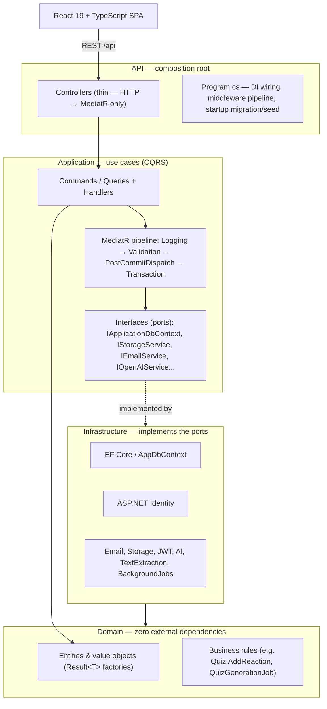

# KNOX

**A university knowledge hub for IT students** — courses, hierarchical course materials, hand-authored and AI-generated quizzes, all built on a strictly-layered .NET backend and a modern React frontend.


---

## Overview

KNOX (internally, `JadaraITKnowledgeSystem`) is an LMS-style platform organized around a **University → Faculty → Major** hierarchy. Students enroll in courses, browse course materials arranged in folders, and take quizzes that are either written by hand by users with the **Writer** role or generated automatically by AI from an uploaded PDF/DOCX/PPTX file.

The backend is a .NET 10 solution built strictly to Clean Architecture, and the frontend is a React 19 + TypeScript SPA. Both are designed to run together via Docker Compose with a single command.

## Features

- **Auth**: JWT access/refresh tokens, role hierarchy (`SuperAdmin > Admin > Writer > User`), OTP-based email verification, forgot/reset password, change password
- **Courses**: course catalog scoped by major, hierarchical folders and materials, course resources, enrollment
- **Quizzes**: hand-authored quizzes (single choice, multiple choice, true/false, short answer), scoring and review, like/dislike reactions
- **AI quiz generation**: upload a PDF/DOCX/PPTX course material, extract its real text (iText7 / DocumentFormat.OpenXml), chunk it, and generate quizzes from the content via OpenAI — processed through a post-commit background job queue rather than blocking the request
- **Profile**: editable profile, profile picture upload/crop, academic info (university/faculty/major)
- **i18n**: English and Arabic

## Tech Stack

**Backend** — .NET 10, Clean Architecture (Domain / Application / Infrastructure / API), EF Core 10 + SQL Server, ASP.NET Identity + JWT, MediatR 12 (CQRS), FluentValidation, OpenAPI + Swagger UI, RFC 7807 problem details, health checks; xUnit test suites (integration tests on real SQL Server via Testcontainers).

**Frontend** (`../KNOX_Frontend/uni-hub`, sibling directory) — React 19, TypeScript, Vite 7, React Router 7, TanStack Query, Axios, Tailwind v4 + shadcn/ui, react-i18next.

**Infrastructure** — Docker Compose (SQL Server 2022, API, nginx-served SPA), local disk storage served via ASP.NET static files, Brevo (primary) / AhaSend (fallback) for transactional email, OpenAI for AI quiz generation.

## Architecture

The backend follows Clean Architecture with a strict dependency direction — inner layers never depend on outer ones:


```mermaid
flowchart TD
    subgraph API["API — composition root"]
        Controllers["Controllers (thin — HTTP ↔ MediatR only)"]
        Program["Program.cs — DI wiring, middleware pipeline, startup migration/seed"]
    end

    subgraph Application["Application — use cases (CQRS)"]
        Commands["Commands / Queries + Handlers"]
        Behaviours["MediatR pipeline: Logging → Validation → PostCommitDispatch → Transaction"]
        Ports["Interfaces (ports): IApplicationDbContext, IStorageService, IEmailService, IOpenAIService..."]
    end

    subgraph Infrastructure["Infrastructure — implements the ports"]
        EFCore["EF Core / AppDbContext"]
        Identity["ASP.NET Identity"]
        Services["Email, Storage, JWT, AI, TextExtraction, BackgroundJobs"]
    end

    subgraph Domain["Domain — zero external dependencies"]
        Entities["Entities & value objects (Result&lt;T&gt; factories)"]
        DomainLogic["Business rules (e.g. Quiz.AddReaction, QuizGenerationJob)"]
    end

    Controllers --> Commands
    Commands --> Behaviours
    Behaviours --> Ports
    Ports -.implemented by.-> Infrastructure
    Commands --> Entities
    Infrastructure --> Domain

    Frontend["React 19 + TypeScript SPA"] -->|REST /api| Controllers
```

```
KNOX_Backend/
├── JadaraITKnowledgeSystem.Domain/          # Entities, value objects, domain logic. Zero external dependencies.
├── JadaraITKnowledgeSystem.Application/     # Use cases (CQRS): Commands/Queries, interfaces, MediatR pipeline
├── JadaraITKnowledgeSystem.Infrastructure/  # EF Core, Identity, email/storage/AI services, background jobs
└── JadaraITKnowledgeSystem.API/             # Composition root: controllers, request contracts, error handling, Program.cs
tests/
├── JadaraITKnowledgeSystem.UnitTests/        # Domain, validators, pipeline behaviours, infrastructure services (no database)
└── JadaraITKnowledgeSystem.IntegrationTests/ # Handlers, migrations and the HTTP API against real SQL Server (Testcontainers)

KNOX_Frontend/uni-hub/                        # React 19 + TypeScript SPA (sibling repo)
├── src/features/                             # auth, courses, quizzes, profile, dashboard, ...
├── src/shared/                                # shadcn/ui components, shared UI primitives
└── src/lib/                                   # API client, routing, i18n
```

Key patterns: every use case is a MediatR `Command`/`Query` + `Handler`; domain and application operations return a `Result<T>` instead of throwing for expected failures; `TransactionBehavior` wraps every `*Command` in an EF Core transaction automatically; a `DispatchPostCommitJobsBehavior` sits just outside the transaction so background work (like AI quiz generation) is only ever queued **after** the commit has genuinely succeeded — no polling, no arbitrary delays.

## Getting Started

### Prerequisites

- [Docker](https://www.docker.com/) with Docker Compose v2 (the whole stack, including SQL Server, runs in containers)
- For local development without containers: .NET SDK 10 and Node.js 22

### Quick Start (Docker)

```bash
# From SP/, the folder that contains docker-compose.yml, KNOX_Backend/ and KNOX_Frontend/
cp .env.example .env    # set DB_SA_PASSWORD and JWT_SECRET at minimum
docker compose up --build -d
```

- App: **http://localhost:5173**. nginx serves the SPA and proxies `/api` and `/uploads` to the API.
- API (loopback only): **http://127.0.0.1:5001**. Set `OPENAPI_ENABLED=true` for Swagger UI at `/swagger`.
- Health: `/health/live` (process) and `/health/ready` (database reachable).

Compose starts SQL Server 2022 (volume `knox-sqldata`), then the API, which applies EF Core migrations and seeds on startup (volume `knox-uploads` holds uploaded files), and then the frontend. Each service waits until the one before it is healthy. SQL Server has no arm64 image, so on Apple Silicon it runs under emulation.

### Running Locally (no Docker for the app)

```bash
# A throwaway SQL Server for development
docker run -d --name knox-sql -e ACCEPT_EULA=Y -e MSSQL_SA_PASSWORD='Your_strong_pw1' \
  -p 1433:1433 mcr.microsoft.com/mssql/server:2022-latest

cd JadaraITKnowledgeSystem.API
dotnet user-secrets set "ConnectionStrings:DefaultConnection" \
  "Server=localhost,1433;Database=KnoxDb;User ID=sa;Password=Your_strong_pw1;TrustServerCertificate=True"
dotnet run                 # http://localhost:5001, Swagger at /swagger; migrates + seeds in Development

# Frontend (separate terminal)
cd ../../KNOX_Frontend/uni-hub
npm ci
npm run dev                # http://localhost:5173
```

`appsettings.Development.json` holds a development-only JWT key. Real secrets never go in `appsettings*.json`: use user-secrets locally and environment variables in containers.

### Configuration

Every option is bound and validated at startup. A missing or invalid required value stops the app with a clear error.

| Section (env var prefix) | Keys | Notes |
|---|---|---|
| `ConnectionStrings` | `DefaultConnection` | Required. |
| `JwtSettings` | `Secret`, `Issuer`, `Audience`, `ExpirationMinutes`, `RefreshTokenDays` | `Secret` is required and must be 32+ characters. |
| `Database` | `MigrateOnStartup`, `SeedOnStartup` | Migrations run automatically only when enabled (Development and Compose do). |
| `Storage` | `BaseUrl`, `RootPath`, `RequestPath` | `BaseUrl` is the public origin used in upload URLs. |
| `Cors` | `AllowedOrigins` | |
| `AuthSettings` | `RequireEmailVerification` | Needs an email provider when true. |
| `Brevo` / `AhaSend` | API keys and sender | Brevo is used if configured, else AhaSend, else emails are only logged. |
| `OpenAI` | `ApiKey`, `Model`, ... | Optional. Without a key, generation jobs fail with `OpenAI.NotConfigured`. |
| `ForwardedHeaders` | `Enabled` | Enable only behind a trusted reverse proxy (Compose does). |
| `OpenApi` | `Enabled` | Defaults to on in Development only. |

In environment variables, `:` becomes `__`, for example `JwtSettings__Secret`.

### Database Migrations

```bash
dotnet tool install -g dotnet-ef   # once
export KNOX_MIGRATIONS_CONNECTION="Server=localhost,1433;Database=KnoxDb;User ID=sa;Password=...;TrustServerCertificate=True"
dotnet ef migrations add <Name> -p JadaraITKnowledgeSystem.Infrastructure -s JadaraITKnowledgeSystem.Infrastructure -o Migrations
```

The integration suite fails if the model has changes with no migration, and it runs an upgrade test from the previous schema with dirty data.

### Running the Tests

```bash
dotnet test JadaraITKnowledgeSystem.sln   # Docker must be running
```

- **Unit tests**: no external dependencies.
- **Integration tests**: Testcontainers starts a SQL Server 2022 container once per run. They cover handlers, transactions, every migration and the HTTP API end to end: auth flows, token rotation and reuse detection, OTP limits, uploads, concurrency and problem details. The OpenAI call is the only external dependency that is not exercised.

CI (`.github/workflows/ci.yml`) runs the build with warnings as errors, both test suites, and a Docker image build.

## Seeded Accounts

| Role | Email | Password |
|---|---|---|
| SuperAdmin | `admin@knox.com` | `Admin@123456` |

**Change this password immediately on any shared or production deployment.** Seeded academic hierarchy: **Jadara University** → **Faculty of Information Technology** → **Computer Science** / **Information Technology**.

## API Conventions

- Routes are lower-case (`/api/users/me`, `/api/courses/{id}/contents`). Enums are sent and returned as strings (numbers are also accepted).
- Errors are always `application/problem+json` (RFC 7807) with `traceId`. Business errors add a `code` (for example `Auth.InvalidCredentials`), and validation errors add `errors` keyed by field.
- Actions that return nothing respond with `204 No Content`.
- Auth endpoints are rate limited per client IP: login and register at 5 per minute; sending, verifying and redeeming OTPs at 3 per minute.

## Known Limitations

- **AI quiz generation needs an OpenAI API key.** Everything up to the OpenAI call (extraction, chunking, the background job, failure handling) is tested.
- **Two user id spaces**: the ASP.NET Identity id (JWT `sub`) and the domain `Users` id (`domain_user_id` claim).
- Password reset is **OTP-based** (a 6-digit code emailed to the user), not a magic link.

## License

No license has been specified for this project yet.
